

  # آموزش استفاده از خدمات Anaheed

- سرویس مورد استفاده در Anaheed یا به عبارتی "EASE" بر اساس یک باور به وجود آمده است: دسترسی حداکثری به محتوای امن یا Extensive Access to Safe Exploration

- برای بهره‌مندی از تمامی قابلیت‌های سرویس، تنظیمات ذکر شده در پایین را بر اساس نوع سیستم‌عامل مورد استفاده دستگاه خود، انتخاب و با دقت انجام دهید.

- # Android

1. ابتدا نرم‌افزار v2rayNG را از Play Store یا از لینک زیر دانلود کنید:

    
     https://github.com/Anaheed-support/guide/blob/main/applications/v2rayNG-android.apk
 ---
2. پس از نصب و اجرای نرم‌افزار، صفحه زیر را خواهید دید.

  <table>
    <tr>
      <td> 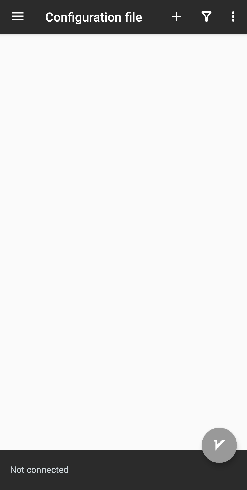 </td>
    </tr>
  </table>
  
---

3. لینکی که از طریق Whatsapp, email یا روش‌های دیگر برای شما فرستاده شده است را انتخاب و copy کنید.

<table>
    <tr>
      <td> 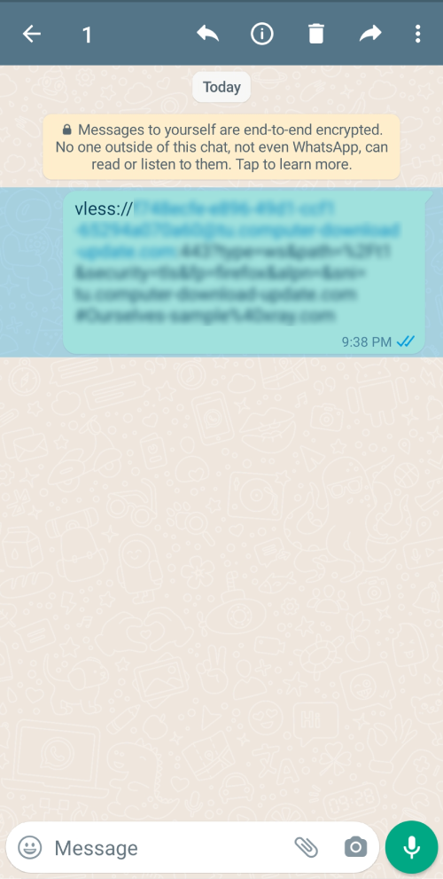 </td>
    </tr>
  </table>

<table>
    <tr>
      <td> 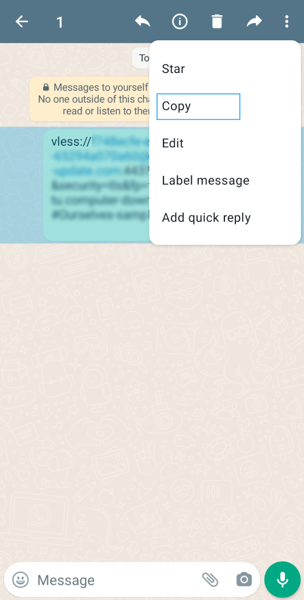 </td>
    </tr>
  </table>
  
---
4. نرم‌افزار v2rayNG را باز کرده، بر روی + زده و گزینه دوم از بالا یعنی "Import config from Clipboard" انتخاب کنید.

<table>
    <tr>
      <td>  </td>
    </tr>
  </table>

<table>
    <tr>
      <td> 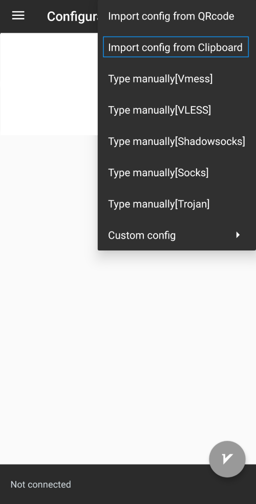 </td>
    </tr>
  </table>

در صورتی که منوهای نرم‌افزار فارسی هستند، گزینه "پیکربندی را از کلیپ‌بورد وارد کنید" را انتخاب کنید.

<table>
    <tr>
      <td> 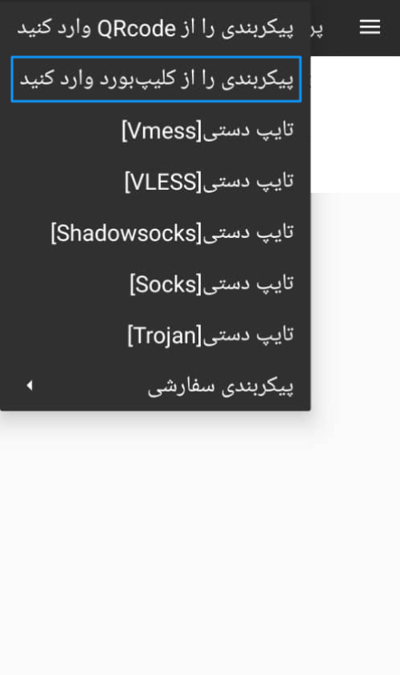 </td>
    </tr>
  </table>
  
---
5. بعد از اضافه شدن یک لینک در صفحه اول نرم‌افزار، در پایین صفحه روی دکمه دایره‌ای شکل طوسی رنگی که حرف "V" بر روی آن نوشته شده کلیک کنید.

<table>
    <tr>
      <td> 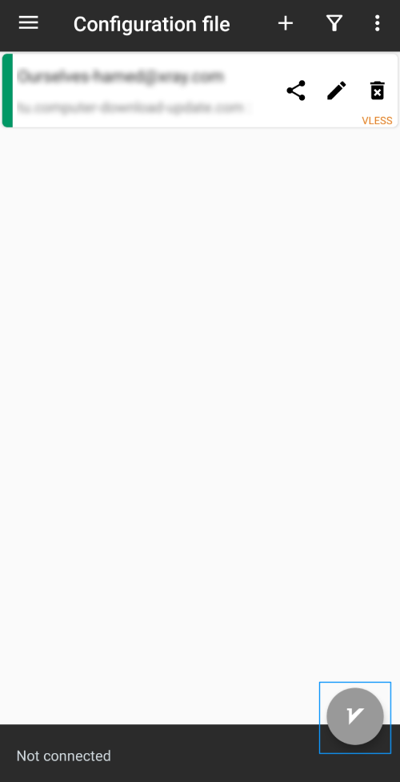 </td>
    </tr>
  </table>
  
---
6. در مرحله بعد، با زدن دکمه OK با ساخت یک کانکشن توسط v2rayNG موافقت کنید.

<table>
    <tr>
      <td> 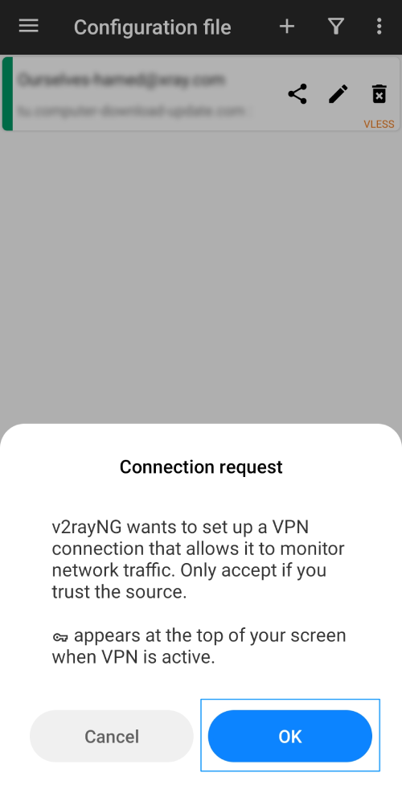 </td>
    </tr>
  </table>
  
---
7. تبدیل رنگ دکمه دایره‌ای شکل از طوسی به سبز، نمایش واژه VPN در بالای صفحه گوشی و نمایش واژه "Connected" و یا "متصل است" در پایین صفحه نرم‌افزار، همگی نشانگر برقراری اتصال دستگاه با سرور EASE می‌باشد.
<table>
    <tr>
      <td> 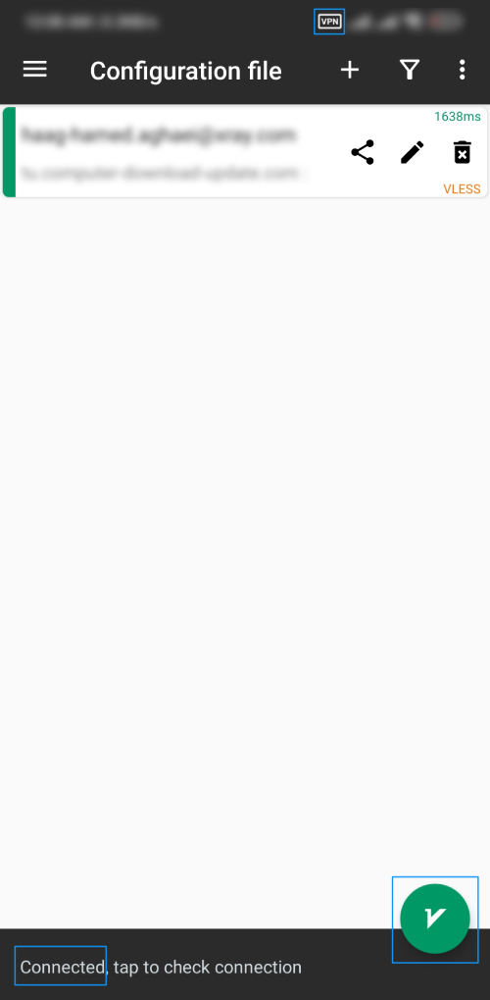 </td>
    </tr>
  </table>
  
---

برای برقراری ارتباط همیشگی با EASE و عدم نیاز به قطع کردن آن در صورت نیاز به استفاده از وب‌سایت‌ها و نرم‌افزارهای ایرانی، لازم است تا تنظیماتی روی نرم‌افزار صورت بگیرد. با انجام این تنظیمات، تبادل اطلاعات بین دستگاه و نرم‌افزارها و یا وب‌سایت‌های ایرانی، علی‌رغم فعال بودن EASE، از داخل EASE عبور نخواهد کرد و نوع ارتباط مستقیم خواهد بود. اکیداً توصیه می‌کنیم این تنظیمات را برای سهولت در کار با EASE انجام دهید. 

8. در ابتدا لازم است فایل iran.dat را از لینک پایین دانلود کنید.

https://github.com/Anaheed-support/guide/blob/main/databases/iran.dat

---

9. پس از دانلود فایل، v2rayNG راباز کرده و روی "سه خط عمودی" زده و گزینه سوم از بالا با نام "Geo asset files" را انتخاب می‌کنیم. 

<table>
    <tr>
      <td> 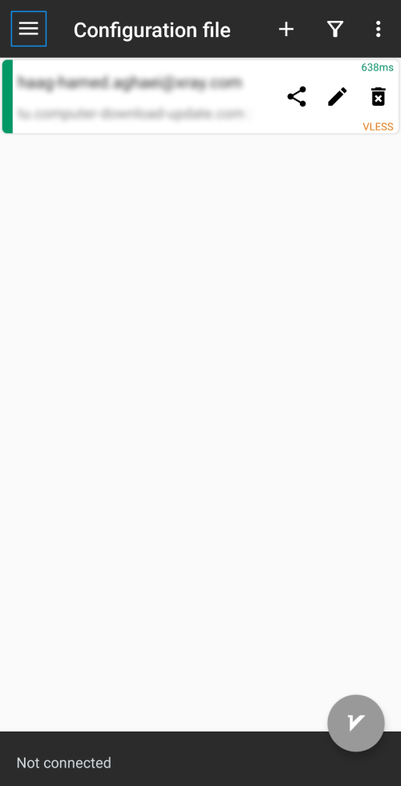 </td>
    </tr>
  </table>

<table>
    <tr>
      <td> 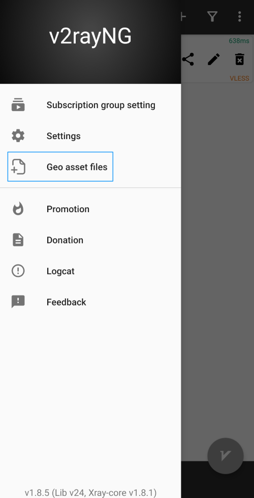 </td>
    </tr>
  </table>

  ---
  10. در صفحه جدید، با زدن دکمه + در بالای صفحه نرم‌افزار، فایل iran.dat را که در مرحله ۸ دانلود کرده بودیم را بارگذاری می‌کنیم. 
<table>
    <tr>
      <td> 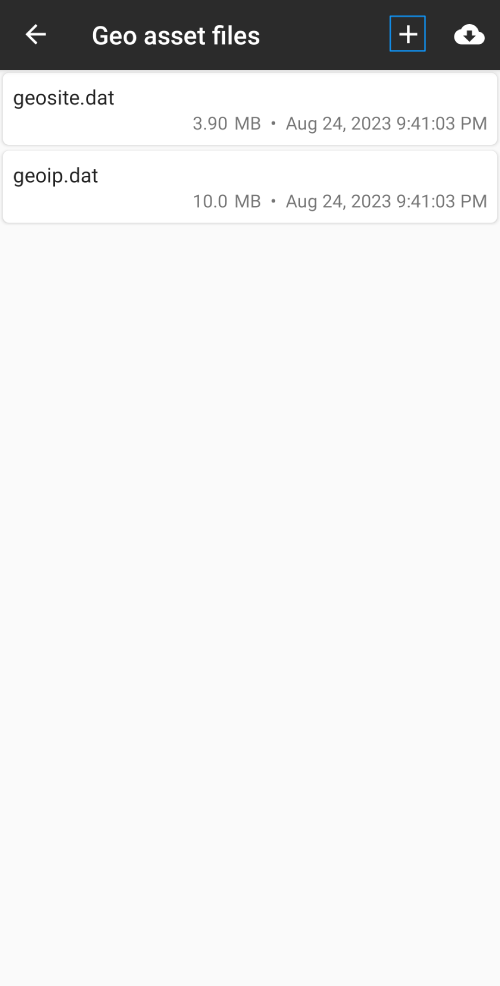 </td>
    </tr>
  </table>

<table>
    <tr>
      <td>  </td>
    </tr>
  </table>

پس ازاطمینان از بارگذاری iran.dat در بخش Geo asset files، با زدن دکمه "فِلِش" به صفحه اصلی برمی‌گردیم.
  <table>
    <tr>
      <td> 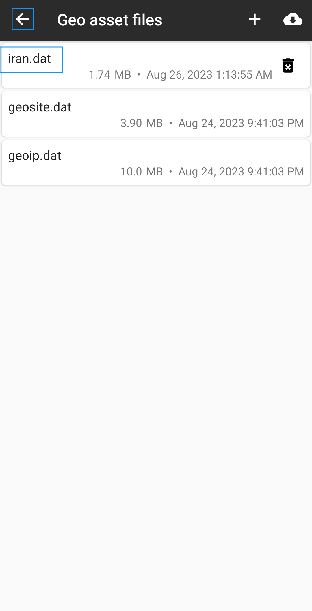 </td>
    </tr>
  </table>

  ---
  11. بار دیگر روی "سه خط عمودی" زده و این بار گزینه دوم از بالا یعنی Settings را انتخاب می‌کنیم. 

<table>
    <tr>
      <td>  </td>
    </tr>
  </table>

<table>
    <tr>
      <td>  </td>
    </tr>
  </table>

  ---

  12. 
