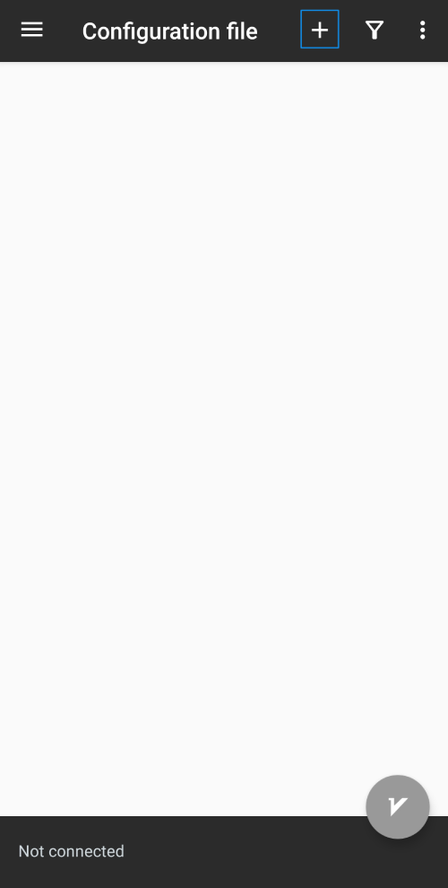

  # آموزش استفاده از خدمات Anaheed

- سرویس مورد استفاده در Anaheed یا به عبارتی "EASE" بر اساس یک باور به وجود آمده است: دسترسی حداکثری به محتوای امن یا Extensive Access to Safe Exploration

- برای بهره‌مندی از تمامی قابلیت‌های سرویس، تنظیمات ذکر شده در پایین را بر اساس نوع سیستم‌عامل مورد استفاده دستگاه خود، انتخاب و با دقت انجام دهید.

- # Android

1. ابتدا نرم‌افزار v2rayNG را از Play Store یا از لینک زیر دانلود کنید:

    
     https://github.com/Anaheed-support/guide/blob/main/applications/v2rayNG-android.apk
 ---
2. پس از نصب و اجرای نرم‌افزار، صفحه زیر را خواهید دید.

  <table>
    <tr>
      <td>  </td>
    </tr>
  </table>
  
---
3. لینکی که از طریق Whatsapp, email یا روش‌های دیگر برای شما فرستاده شده است را انتخاب و copy کنید.

<table>
    <tr>
      <td>  </td>
    </tr>
  </table>

<table>
    <tr>
      <td>  </td>
    </tr>
  </table>
---

4. نرم‌افزار v2rayNG را باز کرده، بر روی + زده و گزینه دوم از بالا یعنی "Import config from Clipboard" انتخاب کنید.

<table>
    <tr>
      <td>  </td>
    </tr>
  </table>

<table>
    <tr>
      <td>  </td>
    </tr>
  </table>

در صورتی که منوهای نرم‌افزار فارسی هستند، گزینه "پیکربندی را از کلیپ‌بورد وارد کنید" را انتخاب کنید.

<table>
    <tr>
      <td>  </td>
    </tr>
  </table>
---
5. بعد از اضافه شدن یک لینک در صفحه اول نرم‌افزار، در پایین صفحه روی دکمه دایره‌ای شکل طوسی رنگی که حرف "V" بر روی آن نوشته شده کلیک کنید.

<table>
    <tr>
      <td>  </td>
    </tr>
  </table>
---
6. در مرحله بعد، با زدن دکمه OK با ساخت یک کانکشن توسط v2rayNG موافقت کنید.

<table>
    <tr>
      <td>  </td>
    </tr>
  </table>
---
7. 

